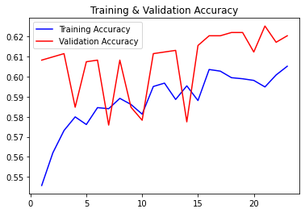

# Machine-Learning-on-Bone-Fracture-Images(A Medical Image-processing library)

Machine learning is an efficient and powerful tool to achieve high accuracies on classification of medical diagnostic images.

Our group decided to develop a deep learning model to classify medical diagnostic images(X-ray) of patient's **forearm** bone fracture from those are not fractured.

The dataset we decided to use and train is from the bone X-Ray Deep Learning Competition of Stanford MURA ML Group(https://stanfordmlgroup.github.io/competitions/mura/).

Our main tasks include:
1.Initial data cleaning and dataset selection to ensure appropriate train/test set sizes.
2.Select appropriate traning model and classification method.
3.Ensure a high accuracy of the traning model.

Our altimate goal is to build a medical **image-processing library**. The library should include some functions that can load, standardize and process the image. The output is whether the result is positive or negative based on the image provided.

The functions in our library will include:
1. load_images
2. train_images

Our altimate goal is to build a medical image-processing library. The library should 
Each group member's task is yet to be discussed.

Author

Candice Li (shuyi.li@duke.edu)

Yiyang Zhang (yiyang.zhang381@duke.edu)

Ashley Hu (mengyi.hu@duke.edu)

#outcomes
Since it takes really long to train and test the data, the results are displayed here:

